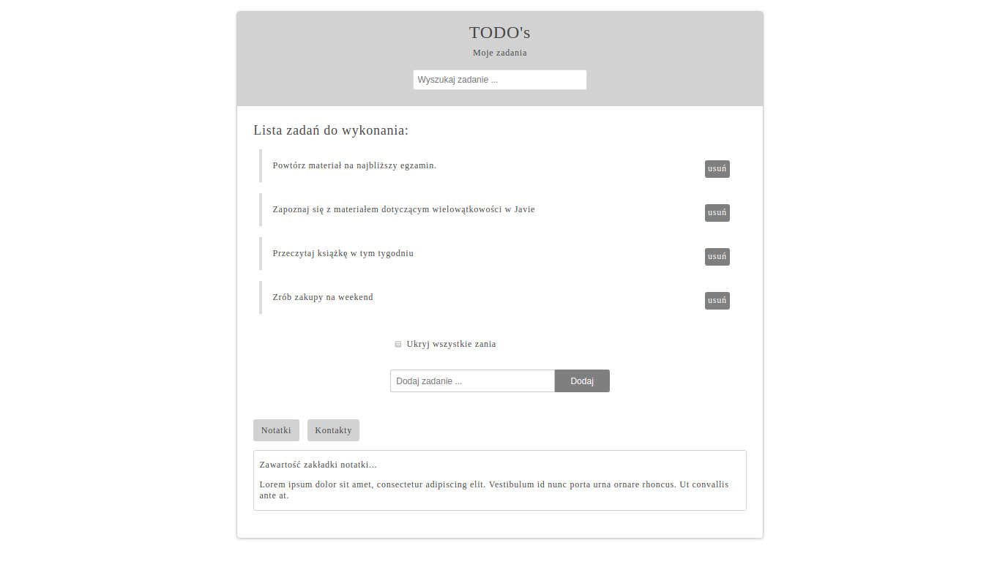

## Getting started
1. Import files into local hard drive
2. Run Index.html in a local web browser

## Functionality
The application allows adding, removing, hiding and searching for tasks to do.

## Technologies used
- Java Script
- CSS
- HTML

## Sample image from the app

